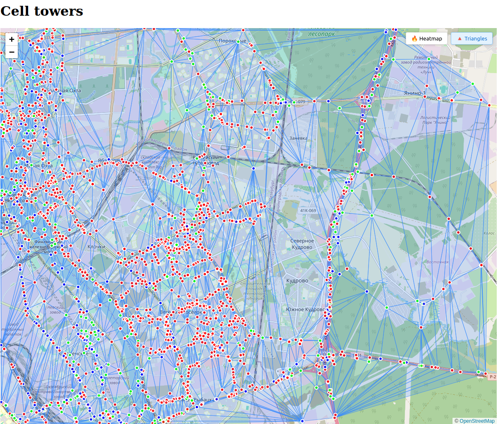

# Cell Tower Visualization Service

<div style="display: flex; justify-content: space-between;">
  
  
</div>

A  visualization service for cell tower data with heatmap and triangulation capabilities.

## Features
| Feature |
|---------|
| 📡 **Interactive Visualization**  |
| 🔥 **Heatmap Generation** |
| 📐 **Tower Triangulation** |

## Tech Stack

### Frontend
- Vue.js 3

### Backend
- FastAPI (Python)
- C++/CGAL (Heavy computations)
- PostgreSQL
- gRPC

## Deploy 
```
cd docker
docker-compose up
```
